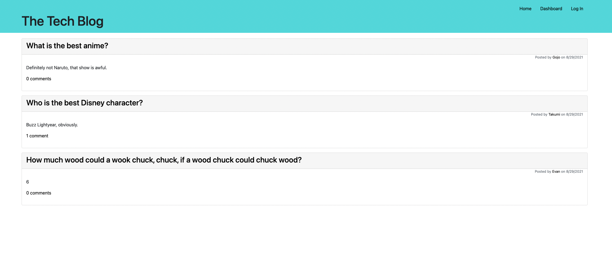

# MVC Tech Blog

## Description

A simple blog site that allows users to to publish their own thoughts in to blog posts. Other users can respond to posts and express their feelings on the subject and keep the conversation going. You are able to create your own profile and log in to see your own posts and what feedback you have gotten on them.

## Using the Site

When you first access the website, you can begin by creating your login. In the top right corner you are able to click the link to log in. If you do not have an existing login, you can create one on that page.

Once you are logged in you will have access to the Dashboard where you can create and view your existing posts.

One posts are created, they will be added to the homepage as well. 

On the home page, you can click on other user's posts where you can reply to them.

## Installing

* clone the repo: https://github.com/evancastillo/mvc-tech-blog
* add your MYSQL info to the .env file
* create the database in MYSQL: tech_blog_db
* run "npm start"

GitHub: https://github.com/evancastillo/mvc-tech-blo
Heroku: https://rocky-island-43645.herokuapp.com/